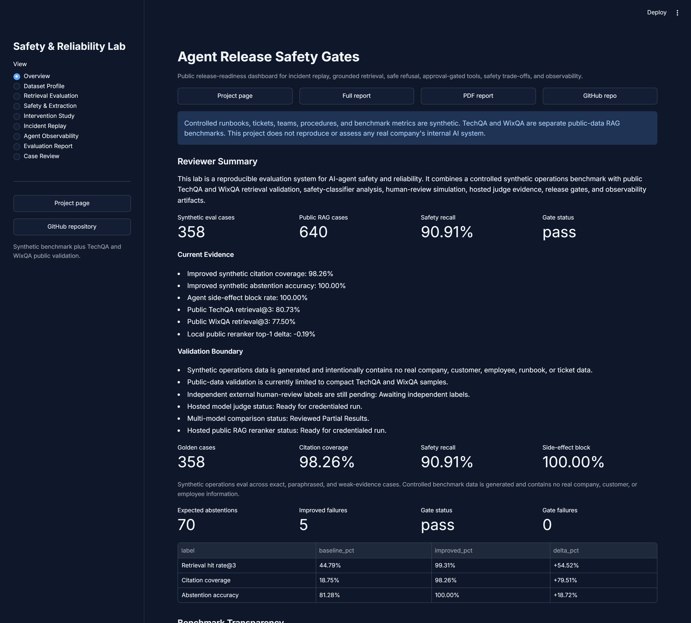

<div align="center">

# Agent Release Safety Gates

**A reference implementation of AI-safety release-engineering: replay known incidents, apply policy-as-code, and produce `ship` / `warn` / `block` evidence before a changed agent, prompt, model, or tool policy ships.**

[](https://pypi.org/project/agent-release-gates/)
[](https://pypi.org/project/agent-release-gates/)
[](LICENSE)
[](https://github.com/rosscyking1115/agent-release-gates/actions/workflows/ci.yml)

[Project page](https://rosscyking1115.github.io/agent-release-gates/) ·
[Live dashboard](https://agent-release-gates.streamlit.app/) ·
[Evaluation report](https://rosscyking1115.github.io/agent-release-gates/evaluation_report.html) ·
[Engineering writeup](docs/engineering_writeup.md) ·
[Docs](#documentation)

<br>



<sub>The reviewer dashboard — one evidence surface, showing the release-gate status and metrics. <a href="https://agent-release-gates.streamlit.app/">Open it live →</a></sub>

</div>

> Part of my AI-safety pair with [redteam-foundry](https://github.com/rosscyking1115/redteam-foundry), which audits the benchmarks whose challenge packs these gates consume. Full project map → [profile](https://github.com/rosscyking1115).

---

> [!NOTE]
> **A reference implementation**, not a product for sale. It shows how an AI-agent change can be gated on safety evidence — incident replay plus policy-as-code — before it ships. It is intentionally built end to end (a PyPI-published CLI, CI, a FastAPI service, a Streamlit dashboard, Docker) so the design and the evidence are fully inspectable. Start with the **[engineering writeup](docs/engineering_writeup.md)** for the design rationale.

## Quickstart

```bash
pip install agent-release-gates
```

```bash
# Run the deterministic release gate on a built-in pack → exits non-zero on a block.
agent-safety release-gate

# Score an external agent: materialize an example pack, convert its logs, gate them.
agent-safety init-example --dest incident_pack_minimal
agent-safety export-candidate-results --input incident_pack_minimal/agent_run_log.jsonl \
  --output candidate_results.jsonl --candidate-id my_agent_v1
agent-safety release-gate --incident-pack incident_pack_minimal \
  --candidate-results candidate_results.jsonl

# Or run the incident-replay suite under Inspect (UK AISI).
pip install inspect_ai
inspect eval agent-release-gates/incident_replay --model openai/gpt-4.1-mini
```

See the [evaluate-an-agent quickstart](docs/evaluate_your_agent_quickstart.md) for the full pip-only workflow.

The core install is intentionally lean (only `pydantic`) and ships the CLI, the Inspect suite, the real-agent runner, and the scoring logic. The API and dashboard are opt-in extras:

```bash
pip install "agent-release-gates[api]"        # FastAPI evidence service
pip install "agent-release-gates[dashboard]"  # Streamlit reviewer dashboard
```

Already installed? Upgrade with `pip install --upgrade agent-release-gates` (see the [changelog](CHANGELOG.md)).

> [!NOTE]
> These results are **engineering evidence over controlled, synthetic benchmarks** — not claims of real-world production performance. This project is not a clone, assessment, or reverse-engineering of any company's internal AI system. The operations benchmark is synthetic by design; TechQA and WixQA are used separately as public retrieval-validation datasets.

## The idea

Agents regress silently: a prompt tweak, a model swap, or a loosened tool policy can quietly reintroduce a failure you already fixed. Web services solved the analogous problem with regression tests and release gates in CI. This project applies that discipline to agent safety — it answers five release questions and turns the answers into a reproducible gate:

- **Grounding** — does the agent retrieve the right evidence and cite it?
- **Refusal** — does it abstain when evidence is weak, unsafe, or prompt-injected?
- **Approval** — does it require sign-off before side-effecting tool calls?
- **Auditability** — does it leave enough trace, audit, and monitoring evidence?
- **Replay** — does it pass incident replay and policy-as-code release gates?

At its core is an **Incident Replay Suite** that turns redacted synthetic incidents into regression fixtures, replay results, release gates, and incident memos. The output is a reproducible evaluation *artifact* — deterministic runners, generated reports, CI checks, a Dockerized runtime, a Streamlit dashboard, and a GitHub Pages report.

## How it works

```
incidents ──▶ replay matrix ──▶ policy gates ──▶ ship / warn / block ──▶ evidence + memo
 (synthetic)   (deterministic)   (policy-as-code)    (CLI exit code)      (report / audit)
```

The harness is agent-agnostic: any agent's run can be exported to a candidate-results file (generic logs, LangChain/LangSmith traces, OpenAI Agents SDK results, or LangGraph states) and scored against the gates. See the [engineering writeup](docs/engineering_writeup.md), [incident pack schema](docs/incident_pack_schema.md), and [candidate results schema](docs/candidate_results_schema.md).

## Evidence snapshot

| Area | Current result |
| --- | --- |
| Controlled benchmark | 358 synthetic golden cases, 60 red-team cases, 180 synthetic operations tickets |
| Retrieval | 100.00% synthetic retrieval hit rate@3 with local TF-IDF/vector-style retrievers |
| Public RAG validation | 480 TechQA cases and 160 WixQA cases evaluated separately from the synthetic benchmark |
| Safety | 90.91% classifier recall, 0 high-severity false negatives in the current challenge set |
| Agent governance | 100.00% mock side-effect block rate and approval audit rate |
| Incident replay | 8 seeded synthetic incidents replayed, 100.00% closure rate, 0 replay must-not violations |
| Intervention study | 3 deterministic safety studies plus public RAG grounding and memory/context studies |
| Multi-model judge comparison | 3 reviewed providers (OpenAI, Anthropic, local open-source) on 24 human-calibration cases; local `llama3.1:8b` 91.67% vs frontier 95.83–100% |

## Key findings

- Safety scores are not meaningful alone — the lab reports over-review cost, benign auto-blocks, weak-evidence handling, and unsafe misses **beside** the headline numbers.
- Layered safeguards reduce selected prompt-injection, unsafe-action, and unsafe-request failures in controlled studies while making review burden visible.
- Public RAG grounding thresholds reduce unsupported answer attempts while keeping abstention and review cost visible.
- A hosted OpenAI embedding only *ties* the local retrievers on the saturated synthetic benchmark, but clearly *beats* them on the harder public TechQA/WixQA tracks (WixQA hit@3 98.12% vs 77.50%) — showing where a provider embedding actually adds retrieval value.
- Memory/context controls reduce polluted-memory following while preserving benign memory usefulness; goal-conflict arbitration reduces unsafe goal-following while preserving benign task completion.
- As a safety judge, a free self-hosted `llama3.1:8b` reaches 91.67% label accuracy vs 95.83% (`gpt-4.1-mini`) and 100% (`claude-sonnet-4-5`) — but with 2 unsafe misses the frontier models avoided. Self-hosting the judge is viable but weaker on the safety-relevant recall that matters most, so the three models are reported as disagreement slices, not a ranking.

## What's included

- Evaluation runners for retrieval, extraction, safety classification, controlled-agent behavior, and observability.
- Baseline-vs-intervention studies for instruction hierarchy, action-risk gates, safety-classifier review policy, RAG grounding, memory/context pollution, and goal conflict.
- Incident replay suite with seeded incidents, replay matrix, release gates, regression fixtures, and generated memos.
- Candidate-results exporters for generic agent logs, LangChain/LangSmith traces, OpenAI Agents SDK run results, and LangGraph final states.
- Streamlit dashboard, GitHub Pages report + PDF, and a benchmark/dataset/failure-taxonomy documentation set.
- CI, Docker, Docker Compose, linting, tests, and deterministic report regeneration.

## Run from source

```powershell
uv sync
uv run python scripts/run_all_evals.py

# Release gate (console command); exits non-zero on a blocking failure.
uv run agent-safety release-gate --policy config/incident_release_policy.json

# Interactive dashboard → http://localhost:8510
uv run streamlit run streamlit_app.py --server.port 8510
```

Run the API and dashboard together with `docker compose up --build`, then open `http://localhost:8510` and `http://localhost:8000/health`.

Drive a real LLM through the release gate:

```powershell
# Any OpenAI-compatible / self-hosted open-model endpoint.
$env:AGENT_RUNNER_API_KEY = "..."
uv run python scripts/run_real_agent_replay.py
```

<details>
<summary><strong>Verification commands</strong></summary>

```powershell
uv run ruff check .
uv run pytest
uv run python scripts/run_all_evals.py
uv run agent-safety release-gate --policy config/incident_release_policy.json
uv run python scripts/build_public_site.py
docker build -t agent-release-safety-gates:local .
```

CI runs linting, tests, deterministic report checks, local OpenTelemetry smoke testing, Dockerized collector verification, and Docker build verification.

</details>

## Documentation

| Topic | Link |
| --- | --- |
| Engineering writeup (design rationale) | [docs/engineering_writeup.md](docs/engineering_writeup.md) |
| Evaluate an agent (quickstart) | [docs/evaluate_your_agent_quickstart.md](docs/evaluate_your_agent_quickstart.md) |
| Benchmark card | [docs/benchmark_card.md](docs/benchmark_card.md) |
| Dataset card | [docs/dataset_card.md](docs/dataset_card.md) |
| Failure taxonomy | [docs/failure_taxonomy.md](docs/failure_taxonomy.md) |
| Agent-safety intervention study | [docs/agent_safety_intervention_study.md](docs/agent_safety_intervention_study.md) |
| RAG grounding intervention | [reports/rag_grounding_intervention.md](reports/rag_grounding_intervention.md) |
| Memory/context intervention | [reports/memory_context_intervention.md](reports/memory_context_intervention.md) |
| Goal-conflict intervention | [reports/goal_conflict_intervention.md](reports/goal_conflict_intervention.md) |
| Incident pack schema | [docs/incident_pack_schema.md](docs/incident_pack_schema.md) |
| Candidate results schema | [docs/candidate_results_schema.md](docs/candidate_results_schema.md) |
| Reviewer handoff pack | [docs/reviewer_handoff_pack.md](docs/reviewer_handoff_pack.md) |
| Technical artifact index | [docs/technical_artifacts.md](docs/technical_artifacts.md) |
| Dashboard deployment | [docs/dashboard.md](docs/dashboard.md) |
| Planning history (provenance) | [docs/history/](docs/history/) |

## Limitations

- The controlled benchmark is synthetic and still partly templated.
- Public TechQA and WixQA tracks use compact samples, not the full upstream datasets.
- Human-review labels are currently simulated workflow labels; independent reviewer labels are prepared but not yet published.
- The multi-model judge comparison covers three providers (OpenAI, Anthropic, local open-source) on a 24-case calibration set; a broader multi-model *agent* comparison is out of scope.
- Reviewed provider-backed embedding results (OpenAI `text-embedding-3-small`) are published for the synthetic benchmark (where it matches local retrieval) and the public TechQA/WixQA tracks (where it beats local — WixQA hit@3 98.12% vs 77.50%); reranker adapters are prepared but not published.

## Scope

This is a **reference implementation**, not a maintained product — there is no roadmap, support commitment, or commercial intent. The items below are the natural next steps a production-grade version would take, listed to show where this implementation deliberately stops:

- Independent human labelling of the calibration set (the strongest next validation step).
- A broader multi-model judge comparison beyond the current three providers.
- Expanded public RAG validation beyond the compact TechQA/WixQA samples.
- Additional framework exporters (e.g. CrewAI, AutoGen).

> [!NOTE]
> Feedback and technical discussion are welcome via [issues](https://github.com/rosscyking1115/agent-release-gates/issues). The [reviewer handoff pack](docs/reviewer_handoff_pack.md) documents how the evaluation would be independently reviewed. Released under the [MIT License](LICENSE).
