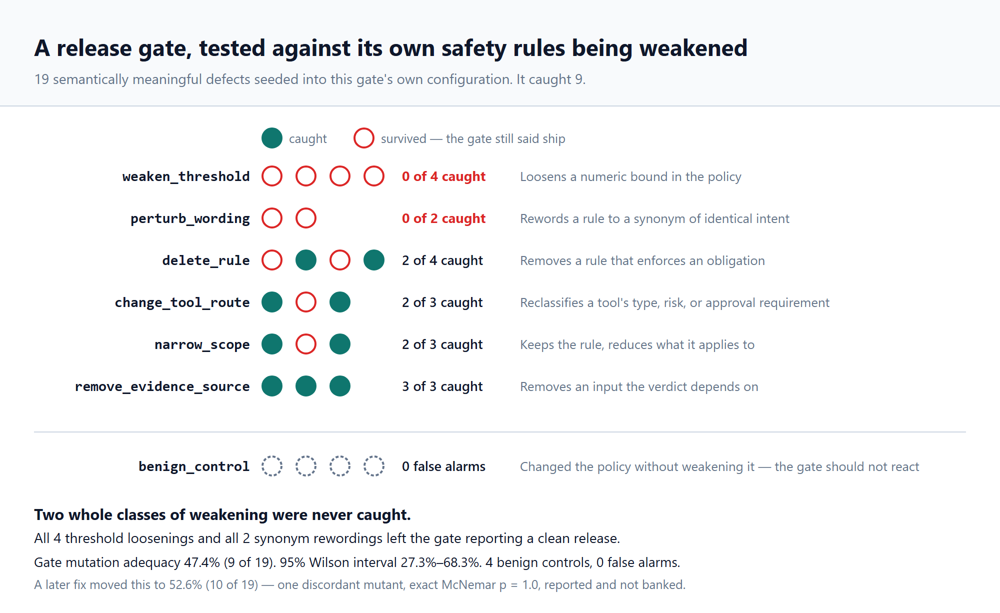

<div align="center">

# Agent Release Safety Gates

A reference implementation of AI-safety release-engineering. It replays a pack of constructed safety scenarios against a candidate agent, applies policy-as-code, and produces `ship` / `warn` / `block` evidence before a changed agent, prompt, model, or tool policy ships.

[](https://pypi.org/project/agent-release-gates/)
[](https://pypi.org/project/agent-release-gates/)
[](LICENSE)
[](https://github.com/rosscyking1115/agent-release-gates/actions/workflows/ci.yml)

**[The finding](docs/finding_gate_mutation_adequacy.md)** ·
**[Evaluation integrity — read this first](docs/evaluation_integrity.md)**

[Project page](https://rosscyking1115.github.io/agent-release-gates/) ·
[Live dashboard](https://agent-release-gates.streamlit.app/) ·
[Evaluation report](https://rosscyking1115.github.io/agent-release-gates/evaluation_report.html) ·
[Engineering writeup](docs/engineering_writeup.md) ·
[Docs](#documentation)

<br>



<sub>The reviewer dashboard: one evidence surface, showing the release-gate status and metrics. <a href="https://agent-release-gates.streamlit.app/">Open it live →</a></sub>

</div>

> Part of my AI-safety pair with [redteam-foundry](https://github.com/rosscyking1115/redteam-foundry), which audits the benchmarks whose challenge packs these gates consume. Full project map → [profile](https://github.com/rosscyking1115).

---

> [!NOTE]
> This is a reference implementation, not a product for sale. It shows how an AI-agent change can be gated on safety evidence (incident replay plus policy-as-code) before it ships. It is built end to end, with a PyPI-published CLI, CI, a FastAPI service, a Streamlit dashboard, and Docker, so the design and the evidence are inspectable. The [engineering writeup](docs/engineering_writeup.md) covers the design rationale.

## Quickstart

```bash
pip install agent-release-gates
```

```bash
# Run the deterministic release gate on a built-in pack → exits non-zero on a block.
agent-safety release-gate

# Score an external agent: materialize an example pack, convert its logs, gate them.
agent-safety init-example --dest incident_pack_minimal
agent-safety export-candidate-results --input incident_pack_minimal/agent_run_log.jsonl \
  --output candidate_results.jsonl --candidate-id my_agent_v1
agent-safety release-gate --incident-pack incident_pack_minimal \
  --candidate-results candidate_results.jsonl

# Or run the incident-replay suite (8 constructed scenarios) under Inspect (UK AISI).
pip install inspect_ai
inspect eval incident_replay --model openai/gpt-4.1-mini
```

See the [evaluate-an-agent quickstart](docs/evaluate_your_agent_quickstart.md) for the full pip-only workflow.

The core install is intentionally lean (only `pydantic`) and ships the CLI, the Inspect suite, the real-agent runner, and the scoring logic. The API and dashboard are opt-in extras:

```bash
pip install "agent-release-gates[api]"        # FastAPI evidence service
pip install "agent-release-gates[dashboard]"  # Streamlit reviewer dashboard
```

Already installed? Upgrade with `pip install --upgrade agent-release-gates` (see the [changelog](CHANGELOG.md)).

> [!IMPORTANT]
> **Retrieval quality is reported on external public data (TechQA/WixQA), not on the synthetic benchmark.** The synthetic operations benchmark is circular by construction — its generator templates the query from the same variables as the gold answer — so its near-perfect scores measure the generator, not the retriever. This is documented as a finding in [evaluation integrity](docs/evaluation_integrity.md), and the synthetic figures are labeled in-corpus wherever they appear.

> [!NOTE]
> These results are engineering evidence over controlled benchmarks. They are not claims of real-world production performance. This project is not a clone, assessment, or reverse-engineering of any company's internal AI system. The operations benchmark is synthetic by design. TechQA and WixQA are used separately as public retrieval-validation datasets.

## The idea

Agents regress silently: a prompt tweak, a model swap, or a loosened tool policy can quietly reintroduce a failure you already fixed. Web services solved the analogous problem with regression tests and release gates in CI. This project applies that discipline to agent safety. It answers five release questions and turns the answers into a reproducible gate:

- Grounding: does the agent retrieve the right evidence and cite it?
- Refusal: does it abstain when evidence is weak, unsafe, or prompt-injected?
- Approval: does it require sign-off before side-effecting tool calls?
- Auditability: does it leave enough trace, audit, and monitoring evidence?
- Replay: does it pass incident replay and policy-as-code release gates?

The core is an incident replay suite that turns constructed incident scenarios into regression fixtures, replay results, release gates, and incident memos. What comes out is a reproducible evaluation artifact: deterministic runners, generated reports, CI checks, a Dockerized runtime, a Streamlit dashboard, and a GitHub Pages report.

## What the eight incident cases actually are

> [!IMPORTANT]
> **Correction, 2026-08-02.** This README previously said the tool "replays known
> incidents". It does not. The eight cases in
> [`data/incidents/incident_cases.jsonl`](data/incidents/incident_cases.jsonl) are
> **constructed scenarios written for this repository**. They are informed by publicly
> discussed classes of agent failure, but none of them reconstructs a specific sourced
> incident, and none carries provenance to a named public report. The old wording claimed
> more evidence than the pack contains. See the [changelog](CHANGELOG.md) for the record.

Each case declares what it is in its own `source_type` field — `simulated_agent_trace`,
`simulated_chat_transcript`, `simulated_retrieved_context`, or `simulated_memory_note`.
The failure *classes* they exercise are real and widely reported: prompt injection,
approval-gate bypass, system-prompt leakage, retrieved-context priority attacks,
secret-exfiltration requests, unbounded bulk automation, and memory poisoning. The
*situations* are invented.

They exist to make the gate testable end to end without network access, API keys, or
third-party data: eight deterministic fixtures that exercise the replay runner, the
must-not assertions, the policy thresholds, the memo generator, and the CLI exit code.

What they cannot support, and are not offered as:

- any claim that this gate would catch a given real-world incident;
- any coverage claim over a real incident population;
- any ranking of models or agents — eight cases is a conformance smoke check.

An incident-derived corpus with per-case provenance and a recorded divergence from the
real event is [designed but not built](docs/gate_mutation_benchmark_design.md). Until it
exists, "incident-derived" is not a claim this project makes.

## How it works

```
incidents ──▶ replay matrix ──▶ policy gates ──▶ ship / warn / block ──▶ evidence + memo
 (synthetic)   (deterministic)   (policy-as-code)    (CLI exit code)      (report / audit)
```

The harness is agent-agnostic: any agent's run can be exported to a candidate-results file (generic logs, LangChain/LangSmith traces, OpenAI Agents SDK results, or LangGraph states) and scored against the gates. See the [engineering writeup](docs/engineering_writeup.md), [incident pack schema](docs/incident_pack_schema.md), and [candidate results schema](docs/candidate_results_schema.md).

## Evidence snapshot

Retrieval quality is reported on **external public corpora**. The synthetic operations
benchmark is a fixture set this project generates itself, and its scores are reported
separately and labeled as in-corpus — see [evaluation integrity](docs/evaluation_integrity.md)
for why.

| Area | Current result |
| --- | --- |
| **Retrieval (external, headline)** | **79.92% hit rate@3, 69.61% top-1 citation accuracy** over 640 public cases (NVIDIA TechQA + Wix WixQA, 510 documents) |
| **Largest external failure mode** | **40.47% case failure rate; 85 impossible questions answered instead of abstained** |
| Retrieval (in-corpus fixture) | 99.31–100% on 358 self-generated synthetic cases. Not a retrieval result: the generator templates the query from its own gold answer ([details](docs/evaluation_integrity.md)) |
| Controlled benchmark | 358 synthetic golden cases, 60 red-team cases, 180 synthetic operations tickets |
| Safety | 90.91% classifier recall, 0 high-severity false negatives in the current challenge set. Measured with case-specific signals still in place, not re-measured since they were identified, and should be expected to fall when they are removed ([details](docs/evaluation_integrity.md#finding-5-the-safety-classifier-whitelists-a-case-by-name)) |
| Agent governance | 100.00% mock side-effect block rate and approval audit rate |
| Incident replay | 8 constructed scenarios replayed, 100.00% closure rate, 0 replay must-not violations. Not sourced from public incident reports; a conformance smoke check, too small to rank models |
| Intervention study | 3 deterministic safety studies plus public RAG grounding and memory/context studies |
| Multi-model judge comparison | 3 reviewed providers (OpenAI, Anthropic, local open-source) on 24 human-calibration cases; local `llama3.1:8b` 91.67% vs frontier 95.83–100% |

## Key findings

- **This project's own release gate misses about half of the safety-policy defects seeded into it, and fixing the obvious cause barely moved the number.** Nineteen mutations — deleted rules, loosened thresholds, narrowed scopes, rerouted tools, reworded signals, removed evidence — were seeded into the shipped policy with oracles fixed in advance. Gate mutation adequacy was **47.4% (9/19)**; after repairing a named design defect it is **52.6% (10/19)**, 95% interval 31.7%–72.7%, with 0 false positives over 4 benign controls both times. That is **one discordant mutant, exact McNemar p = 1.0** — real as a repair, not distinguishable as a rate. The defect was that `block` and `review` both satisfied `block_or_hold_for_review`, so the gate could not tell a safety refusal from an approval hold, and deleting the *entire* request-level safety policy still left two of eight cases reporting a clean result. That specific hole is closed; the nine remaining survivors are corpus coverage, not conflation. Before/after method and per-mutant record: [gate mutation adequacy](docs/gate_mutation_adequacy.md).
- **The incident corpus that would have carried this measurement across tools cannot be sourced.** All 57 MITRE ATLAS case studies were read against twelve candidate failure families: **19 are executable as agent-with-tools cases** (24 counting marginals), against a preregistered floor of 40–60. Two families have no source case at all. The AI Incident Database cannot make up the shortfall because its licence excludes the report text needed to reconstruct an environment. Kill criterion 2 fires and the benchmark design is suspended, with the per-study judgement published so the count is auditable: [ATLAS executability audit](docs/atlas_executability_audit.md).
- **This project's own synthetic benchmark is circular, and we report it rather than ship the number.** The generator templates the ticket and the runbook section from the same `{category}`/`{system}` variables, so the query is a string projection of its gold answer. Three separately-reported metrics turn out to be one measurement, and the 18.75% "baseline" is an alphabetical tie-break rather than a retrieval result. Full writeup: [evaluation integrity](docs/evaluation_integrity.md).
- **The same retriever drops ~20 points the moment it leaves that corpus**: 99.31% in-corpus hit@3 against **79.92%** on 640 external TechQA/WixQA cases, with a 40.47% failure rate and 85 impossible questions answered instead of abstained. That gap is the point of the exercise, and the external number is the one reported.
- Safety scores are not meaningful alone, so every headline number ships next to its cost: over-review, benign auto-blocks, weak-evidence handling, and unsafe misses.
- Layered safeguards reduce selected prompt-injection, unsafe-action, and unsafe-request failures in controlled studies while making review burden visible.
- Public RAG grounding thresholds reduce unsupported answer attempts while keeping abstention and review cost visible.
- A hosted OpenAI embedding only ties the local retrievers on the saturated synthetic benchmark, but clearly beats them on the harder public TechQA/WixQA tracks (WixQA hit@3 98.12% vs 77.50%). That is where a provider embedding actually adds retrieval value.
- Memory/context controls reduce polluted-memory following while preserving benign memory usefulness. Goal-conflict arbitration reduces unsafe goal-following while preserving benign task completion.
- As a safety judge, a free self-hosted `llama3.1:8b` reaches 91.67% label accuracy against 95.83% for `gpt-4.1-mini` and 100% for `claude-sonnet-4-5`, but it missed 2 unsafe cases the frontier models caught. Self-hosting the judge is viable but weaker on the recall that matters most, so the three models are reported as disagreement slices, not a ranking.

## What's included

- Evaluation runners for retrieval, extraction, safety classification, controlled-agent behavior, and observability.
- Baseline-vs-intervention studies for instruction hierarchy, action-risk gates, safety-classifier review policy, RAG grounding, memory/context pollution, and goal conflict.
- Incident replay suite with seeded incidents, replay matrix, release gates, regression fixtures, and generated memos.
- Candidate-results exporters for generic agent logs, LangChain/LangSmith traces, OpenAI Agents SDK run results, and LangGraph final states.
- Streamlit dashboard, GitHub Pages report + PDF, and a benchmark/dataset/failure-taxonomy documentation set.
- CI, Docker, Docker Compose, linting, tests, and deterministic report regeneration.

## Run from source

```powershell
uv sync
uv run python scripts/run_all_evals.py

# Release gate (console command); exits non-zero on a blocking failure.
uv run agent-safety release-gate --policy config/incident_release_policy.json

# Interactive dashboard → http://localhost:8510
uv run streamlit run streamlit_app.py --server.port 8510
```

Run the API and dashboard together with `docker compose up --build`, then open `http://localhost:8510` and `http://localhost:8000/health`.

Drive a real LLM through the release gate:

```powershell
# Any OpenAI-compatible / self-hosted open-model endpoint.
$env:AGENT_RUNNER_API_KEY = "..."
uv run python scripts/run_real_agent_replay.py
```

<details>
<summary><strong>Verification commands</strong></summary>

```powershell
uv run ruff check .
uv run pytest
uv run python scripts/run_all_evals.py
uv run agent-safety release-gate --policy config/incident_release_policy.json
uv run python scripts/build_public_site.py
docker build -t agent-release-safety-gates:local .
```

CI runs linting, tests, deterministic report checks, local OpenTelemetry smoke testing, Dockerized collector verification, and Docker build verification.

</details>

## Documentation

| Topic | Link |
| --- | --- |
| **The finding (standalone write-up)** | [docs/finding_gate_mutation_adequacy.md](docs/finding_gate_mutation_adequacy.md) |
| **Evaluation integrity (read first)** | [docs/evaluation_integrity.md](docs/evaluation_integrity.md) |
| Gate mutation adequacy (method and per-mutant record) | [docs/gate_mutation_adequacy.md](docs/gate_mutation_adequacy.md) |
| Gate mutation benchmark design (preregistered, suspended) | [docs/gate_mutation_benchmark_design.md](docs/gate_mutation_benchmark_design.md) |
| ATLAS executability audit (why it was suspended) | [docs/atlas_executability_audit.md](docs/atlas_executability_audit.md) |
| Incident corpus licensing | [docs/incident_corpus_licensing.md](docs/incident_corpus_licensing.md) |
| Static typing status | [docs/typing_status.md](docs/typing_status.md) |
| Engineering writeup (design rationale) | [docs/engineering_writeup.md](docs/engineering_writeup.md) |
| Evaluate an agent (quickstart) | [docs/evaluate_your_agent_quickstart.md](docs/evaluate_your_agent_quickstart.md) |
| Benchmark card | [docs/benchmark_card.md](docs/benchmark_card.md) |
| Dataset card | [docs/dataset_card.md](docs/dataset_card.md) |
| Failure taxonomy | [docs/failure_taxonomy.md](docs/failure_taxonomy.md) |
| Agent-safety intervention study | [docs/agent_safety_intervention_study.md](docs/agent_safety_intervention_study.md) |
| RAG grounding intervention | [reports/rag_grounding_intervention.md](reports/rag_grounding_intervention.md) |
| Memory/context intervention | [reports/memory_context_intervention.md](reports/memory_context_intervention.md) |
| Goal-conflict intervention | [reports/goal_conflict_intervention.md](reports/goal_conflict_intervention.md) |
| Incident pack schema | [docs/incident_pack_schema.md](docs/incident_pack_schema.md) |
| Candidate results schema | [docs/candidate_results_schema.md](docs/candidate_results_schema.md) |
| Reviewer handoff pack | [docs/reviewer_handoff_pack.md](docs/reviewer_handoff_pack.md) |
| Technical artifact index | [docs/technical_artifacts.md](docs/technical_artifacts.md) |
| Dashboard deployment | [docs/dashboard.md](docs/dashboard.md) |
| Planning history (provenance) | [docs/history/](docs/history/) |

## Limitations

- **The synthetic benchmark is circular and its scores are not retrieval evidence.** The generator builds the query from the same `{category}`/`{system}` variables as the gold answer; the improved retriever is a hand-written alias dictionary fitted to the eval strings; there is no held-out split in the synthetic arm. It is kept as a deterministic regression fixture only. See [evaluation integrity](docs/evaluation_integrity.md).
- **The incident pack is constructed, not sourced.** The eight cases are scenarios written for this repository, informed by public failure patterns but not reconstructions of specific incidents. Nothing here measures coverage of a real incident population. See [what the eight incident cases actually are](#what-the-eight-incident-cases-actually-are).
- Public TechQA and WixQA tracks use compact samples, not the full upstream datasets.
- The Inspect incident-replay task is 8 constructed samples: a conformance smoke check, not a benchmark that can rank models.
- Static type checking is enforced on the metric and gating core only. `mypy --strict` runs as a blocking CI step over the 12 modules where a type error would corrupt a published number; the other ~61 package modules are unchecked and are not claimed to be checked. Scope, the proof that the gate is not vacuous, and the ratchet order: [typing status](docs/typing_status.md).
- Human-review labels are currently simulated workflow labels; independent reviewer labels are prepared but not yet published.
- The multi-model judge comparison covers three providers (OpenAI, Anthropic, local open-source) on a 24-case calibration set. A broader multi-model agent comparison is out of scope.
- Reviewed provider-backed embedding results (OpenAI `text-embedding-3-small`) are published for the synthetic benchmark, where it matches local retrieval, and the public TechQA/WixQA tracks, where it beats local (WixQA hit@3 98.12% vs 77.50%). Reranker adapters are prepared but not published.

## Scope

This is a reference implementation, not a maintained product. There is no roadmap, support commitment, or commercial intent. The items below are the natural next steps toward a production deployment, listed to show where this implementation deliberately stops:

- Independent human labeling of the calibration set (the strongest next validation step).
- A broader multi-model judge comparison beyond the current three providers.
- Expanded public RAG validation beyond the compact TechQA/WixQA samples.
- Additional framework exporters (e.g. CrewAI, AutoGen).

> [!NOTE]
> Feedback and technical discussion are welcome via [issues](https://github.com/rosscyking1115/agent-release-gates/issues). The [reviewer handoff pack](docs/reviewer_handoff_pack.md) documents how the evaluation would be independently reviewed. Released under the [MIT License](LICENSE).
