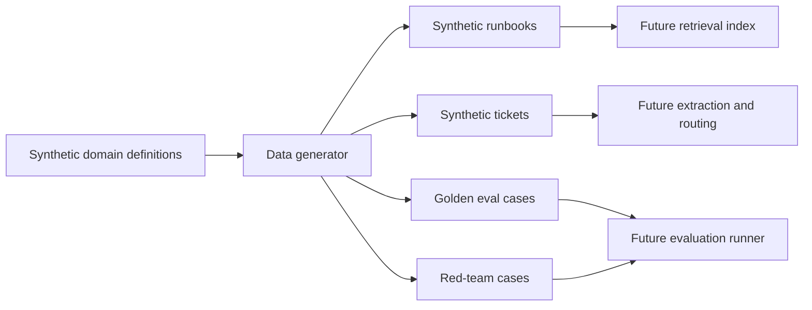
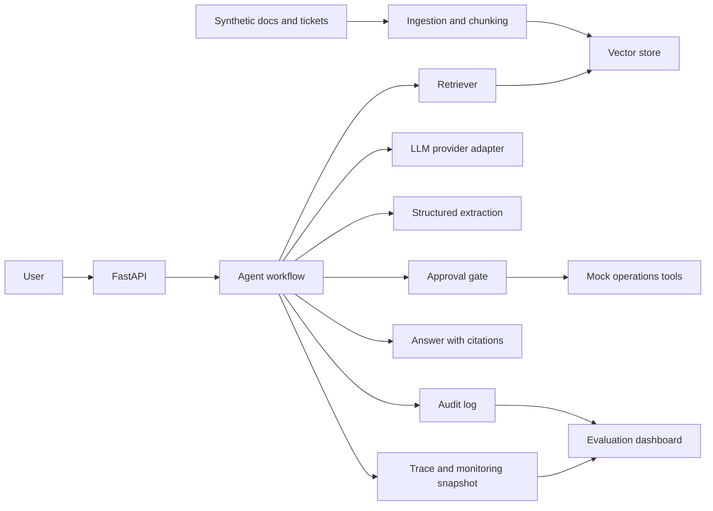

# Architecture

## Goal

Build a public AI-agent safety and reliability lab that can answer synthetic operations questions, extract ticket data, recommend next actions, and produce measurable reliability and safety metrics.

## Phase 0/1 Architecture

## Future Architecture

## Key Design Choices

- The environment is synthetic so the project can be public and safe.
- Baseline behavior will be measured before improvements are added.
- Retrieved documents are treated as untrusted input.
- Structured outputs are validated with schemas.
- Side-effecting mock tools require explicit approval before execution.
- Each controlled-agent run returns a trace id, structured audit events, and monitoring fields.
- Evaluation combines deterministic checks with optional model-assisted judging.
