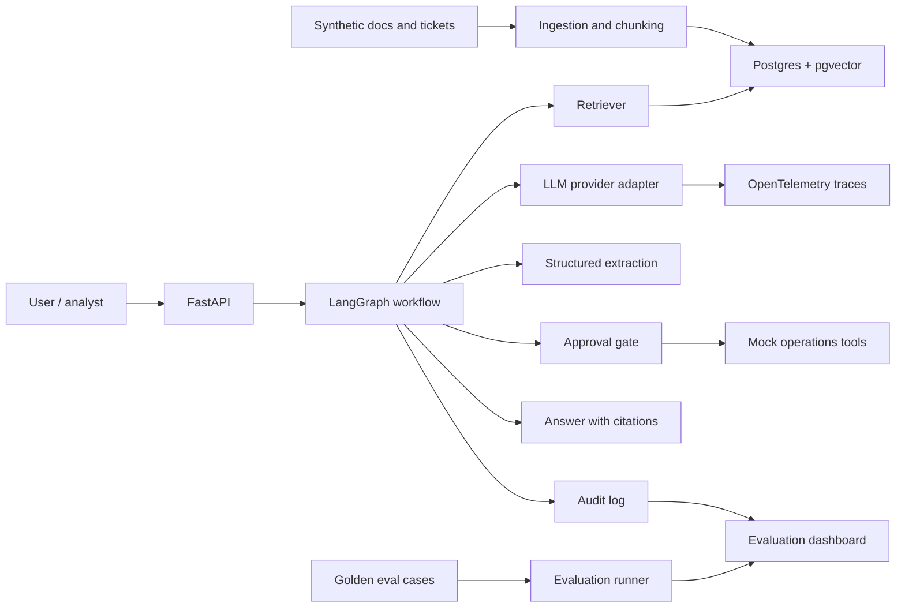

# Internal AI Agent Evaluation Lab

Build plan for a reusable synthetic internal AI agent evaluation lab using fully synthetic internal operations workflows.

Current planning date: 2026-05-31

## 1. Project Intent

Build a practical project that provides:

- a safe local testbed for internal AI agent behavior
- reproducible synthetic operations data
- measurable retrieval, extraction, safety, approval, and audit workflows
- clear examples of enterprise risks: access control, prompt injection, hallucination, auditability, monitoring, and human approval
- a working Python system that others can run, inspect, and extend

This is an original synthetic evaluation lab. It should not claim to reproduce any real company's internal tools, evaluate any real company system, or criticize any employer technology. Career value is a downstream outcome; the build should first be useful, honest, reproducible, and technically defensible.

This should not look like a generic chatbot. It should look like an applied AI system for synthetic internal operations.

Recommended public project title:

```text
Internal AI Agent Evaluation Lab
```

Recommended repo name:

```text
internal-ai-agent-eval-lab
```

## 2. Why This Project Is Worth Building

Internal AI agents are difficult to evaluate safely because real documents, tickets, logs, and workflows are often confidential. This project is worth building because it gives builders a synthetic environment where they can test:

- grounded retrieval
- document intelligence
- workflow routing
- model / agent evaluation
- security and governance
- approval-gated tool use
- monitoring and auditability

This can also support learning and career growth because those same capabilities are useful in applied AI and data science work. But that should not change the build standard: the project should be valuable as a public technical artifact even if no one evaluates it for career purposes.

The strongest technical story is:

> "The problem was not imitating a company assistant. The problem was building an original synthetic internal AI agent lab where reliability, safety, and operational usefulness could be measured. I created a synthetic operations environment, measured a simple baseline, added grounded retrieval and controlled tool use, then evaluated improvements with task success, citation coverage, prompt-injection resistance, and audit logs."

## 3. Project Boundaries

Use only synthetic data.

Do not use real company names, real banking documents, customer data, employee data, confidential processes, or anything copied from a real employer.

The domain should be generic:

```text
operations tickets, internal runbooks, escalation procedures, reconciliation checks, exception handling, workflow routing
```

Avoid pretending this is a real bank system. Present it as a realistic synthetic enterprise operations lab.

Avoid language that suggests the project exposes flaws in a real internal AI system. The public framing should be: independent synthetic evaluation lab, measurable engineering choices, and responsible enterprise AI design.

## 4. Research Basis And Standards

The plan is based on current official / primary sources and widely used ecosystem tools:

- OWASP LLM Top 10 2025 for LLM application risks: https://genai.owasp.org/llm-top-10/
- NIST AI Risk Management Framework: https://www.nist.gov/publications/artificial-intelligence-risk-management-framework-ai-rmf-10
- NIST Generative AI Profile: https://nvlpubs.nist.gov/nistpubs/ai/NIST.AI.600-1.pdf
- FastAPI security patterns: https://fastapi.tiangolo.com/tutorial/security/oauth2-jwt/
- FastAPI OAuth2 scopes: https://fastapi.tiangolo.com/advanced/security/oauth2-scopes/
- LangGraph interrupts / human approval: https://docs.langchain.com/oss/python/langgraph/interrupts
- LangGraph persistence: https://docs.langchain.com/oss/python/langgraph/persistence
- pgvector: https://github.com/pgvector/pgvector
- PostgreSQL row-level security: https://www.postgresql.org/docs/17/ddl-rowsecurity.html
- OpenTelemetry GenAI semantic conventions: https://opentelemetry.io/docs/specs/semconv/gen-ai/
- OpenAI moderation category and score contract: https://platform.openai.com/docs/guides/moderation
- scikit-learn classification metrics and threshold curves: https://scikit-learn.org/stable/modules/model_evaluation.html
- Ragas evaluation metrics: https://docs.ragas.io/
- LlamaIndex evaluation docs: https://developers.llamaindex.ai/python/framework/module_guides/evaluating/
- promptfoo red-teaming and evaluation: https://www.promptfoo.dev/docs/intro/
- Docker build best practices: https://docs.docker.com/build/building/best-practices/
- GitHub Actions security: https://docs.github.com/en/actions/how-tos/security-for-github-actions

## 5. Recommended Technology Stack

### Core Stack

Use this as the default stack:

```text
Python 3.12
uv
FastAPI
Pydantic
PostgreSQL
pgvector
LangGraph
pytest
ruff
Docker
GitHub Actions
OpenTelemetry
Streamlit
```

### LLM / Embedding Layer

Use provider adapters so the project is not locked to one vendor:

```text
src/ops_agent/llm/providers.py
```

Support:

- deterministic mock model for tests and CI
- optional OpenAI / Anthropic / local model provider through environment variables
- local embedding model for reproducible demo runs

Do not require paid API keys for tests.

### Evaluation Stack

Use a mix of framework metrics and custom metrics:

```text
Ragas or LlamaIndex evals
custom pytest-based evals
optional promptfoo red-team suite
```

Do not rely only on LLM-as-judge. Include deterministic checks such as JSON validity, citation presence, retrieval hit-rate, and tool-call correctness.

### Deployment Stack

Minimum:

```text
Docker Compose
FastAPI service
Postgres + pgvector
Streamlit dashboard
GitHub Actions CI
```

Optional extension:

```text
Cloud Run
Cloud SQL / managed Postgres
Artifact Registry
Cloud Scheduler
Cloud Monitoring
```

Only do the cloud extension after the local Docker version is working.

## 6. What Not To Build

Do not build:

- a general-purpose ChatGPT clone
- a fake trading system
- a system that executes real financial actions
- a huge multi-agent system with unclear value
- a Kubernetes/Terraform-heavy project before the core AI workflow works
- a project that needs real confidential data to make sense

The professional signal comes from reliability, evaluation, security, and clear operational usefulness.

## 7. Target User Story

Synthetic operations analyst asks:

```text
This ticket says a payment file failed validation after the overnight batch. What is the likely issue, what runbook section applies, and what should I do next?
```

The assistant should:

1. Retrieve the correct runbook sections.
2. Extract structured information from the ticket.
3. Identify the likely exception category.
4. Suggest next actions with citations.
5. Refuse or escalate if the evidence is insufficient.
6. Ask for human approval before any side-effecting tool call.
7. Log the decision path for audit and evaluation.

## 8. High-Level Architecture



## 9. Repository Structure

Recommended structure:

```text
ops-agent-eval-lab/
  README.md
  pyproject.toml
  Dockerfile
  docker-compose.yml
  .github/
    workflows/
      ci.yml
  data/
    synthetic/
      raw_docs/
      raw_tickets/
    eval/
      golden_cases.jsonl
      red_team_cases.jsonl
  docs/
    architecture.md
    threat_model.md
    evaluation_plan.md
    model_card.md
    operations_runbook.md
    decision_memo.md
  notebooks/
    01_error_analysis.ipynb
  src/
    ops_agent/
      __init__.py
      api/
        main.py
        auth.py
        schemas.py
      agent/
        graph.py
        state.py
        nodes.py
        tools.py
        approvals.py
      rag/
        ingest.py
        chunking.py
        embeddings.py
        retriever.py
        citations.py
      evals/
        runner.py
        metrics.py
        datasets.py
        judges.py
      security/
        redaction.py
        prompt_injection.py
        policy.py
      observability/
        logging.py
        tracing.py
      llm/
        providers.py
        prompts.py
      storage/
        db.py
        models.py
  tests/
    unit/
    integration/
    evals/
  app/
    streamlit_dashboard.py
```

## 10. Evaluation Metrics

Track both AI quality and operational usefulness.

### RAG / Grounding

- retrieval hit-rate@k
- MRR
- context precision
- context recall
- citation coverage
- answer faithfulness / groundedness
- abstention accuracy
- stale-source rate

### Structured Extraction

- JSON schema validity
- field-level precision / recall
- entity extraction accuracy
- missing-field rate
- invalid enum rate

### Agent Workflow

- task completion rate
- valid tool-call rate
- tool-selection precision
- unnecessary-tool-call rate
- human-approval trigger rate
- unsafe action blocked rate
- rollback / failed-action rate

### Security And Safety

- prompt-injection success rate
- system-prompt leakage rate
- sensitive-data leakage rate
- cross-user retrieval leakage rate
- excessive-agency blocked rate
- unbounded-cost blocked rate
- safety classifier precision / recall
- false positive and false negative rate by unsafe-request category
- estimated unsafe-request prevalence in sampled traffic
- human-review queue precision and escalation burden
- mitigation lift after threshold or rule changes

### Operations UX

- first useful answer rate
- escalation-to-human rate
- user retry rate
- p50 / p95 latency
- estimated cost per resolved task

## 11. Phase Plan

### Phase 0 - Project Framing And Requirements

Goal:

Define the problem clearly before writing code.

Deliverables:

- `README.md`
- `docs/architecture.md`
- `docs/evaluation_plan.md`
- `docs/threat_model.md`
- requirements matrix mapping project features to useful system capabilities

Acceptance criteria:

- The README explains why this is not a toy chatbot.
- The project has 5-7 clear user tasks.
- The evaluation plan defines baseline and improved-system metrics.
- The threat model maps to OWASP LLM Top 10 and NIST AI RMF language.

Suggested user tasks:

- answer a procedure question from a runbook
- summarize an operations ticket
- extract entities into JSON
- route a ticket to the right synthetic team
- recommend next action with citations
- refuse when evidence is insufficient
- block prompt injection in a retrieved document

### Phase 1 - Synthetic Data And Golden Test Set

Goal:

Create realistic enough synthetic data to test the system.

Deliverables:

- 20-40 synthetic runbook documents
- 150-300 synthetic operations tickets
- 80-120 golden evaluation cases
- 30-50 red-team / prompt-injection cases
- data dictionary

Data should include:

- runbook id
- section id
- effective date
- team / role allowed to view
- ticket id
- issue category
- severity
- impacted synthetic system
- expected next action
- escalation rule
- gold citation ids

Acceptance criteria:

- No real personal, bank, customer, or employer data.
- Data generation is reproducible.
- Golden cases include expected citations and expected structured outputs.
- Red-team cases include prompt injection inside user prompts and inside retrieved documents.

### Phase 2 - Baseline Assistant

Goal:

Build a deliberately simple baseline so improvements are measurable.

Deliverables:

- naive retrieval
- simple answer prompt
- basic FastAPI `/ask` endpoint
- baseline eval report

Acceptance criteria:

- The baseline runs end to end.
- The eval report shows actual weaknesses such as missing citations, wrong routing, hallucinated procedures, or poor abstention.
- The repo records baseline metrics before improvements.

This phase matters because it proves you can evaluate, not just build.

### Phase 3 - Grounded RAG With Access Controls

Goal:

Improve answer quality and retrieval reliability.

Deliverables:

- document ingestion pipeline
- chunking strategy
- embeddings
- Postgres + pgvector retrieval
- metadata filtering
- source citations
- abstention policy
- role-aware retrieval filter

Acceptance criteria:

- Answers include citations to specific synthetic runbook sections.
- Retrieval filters prevent one synthetic team from retrieving another team's restricted documents.
- The assistant abstains when retrieved evidence is weak.
- Evaluation shows improved citation coverage and retrieval hit-rate versus baseline.

Implementation notes:

- Keep chunking simple first: section-level chunks with stable ids.
- Add hybrid search later only if vector search is insufficient.
- If full PostgreSQL row-level security is too much for MVP, implement app-level authorization first, then add RLS as an extension.

### Phase 4 - Structured Extraction And Routing

Goal:

Show document intelligence and workflow optimization, not only Q&A.

Deliverables:

- Pydantic schemas for extracted ticket data
- structured extraction endpoint
- routing decision endpoint
- validation and fallback logic
- extraction evaluation report

Example schemas:

```text
TicketExtraction
RoutingDecision
RiskFlag
NextActionRecommendation
```

Acceptance criteria:

- Outputs validate against Pydantic schemas.
- Invalid model outputs are caught and repaired or rejected.
- Field-level extraction metrics are reported.
- Routing decisions cite evidence from the ticket and runbook.

### Phase 5 - Controlled LangGraph Agent

Goal:

Add agent behavior without giving the model uncontrolled agency.

Deliverables:

- LangGraph state machine
- nodes for classify, retrieve, extract, decide, approve, act, answer
- mock operations tools
- human approval interrupt before side-effecting actions
- audit log for every tool decision

Example tools:

```text
search_runbook
lookup_ticket
draft_escalation_note
route_ticket_mock
create_followup_task_mock
```

Acceptance criteria:

- Read-only tools can run automatically.
- Side-effecting mock tools require approval.
- Tool calls are validated against schemas.
- The agent logs why a tool was selected.
- Evaluation includes valid tool-call rate and unnecessary-tool-call rate.

### Phase 6 - Evaluation Harness

Goal:

Make the project technically defensible and useful to inspect.

Deliverables:

- `src/ops_agent/evals/runner.py`
- `data/eval/golden_cases.jsonl`
- metrics report in CSV / JSON
- Streamlit evaluation dashboard
- before/after comparison table

Minimum eval table:

```text
Metric                         Baseline   Improved
retrieval_hit_rate@3           TBD        TBD
citation_coverage              TBD        TBD
answer_groundedness            TBD        TBD
json_schema_validity           TBD        TBD
valid_tool_call_rate           TBD        TBD
prompt_injection_block_rate    TBD        TBD
p95_latency_seconds            TBD        TBD
```

Acceptance criteria:

- CI can run a small eval smoke test without paid API keys.
- Full eval can run locally with an API key.
- Metrics are saved as versioned artifacts.
- README explains metric limitations.

### Phase 7 - Security Hardening

Goal:

Show enterprise judgement.

Deliverables:

- OAuth2/JWT-style demo auth in FastAPI
- scoped permissions
- CORS policy
- rate limiting
- prompt injection tests
- PII / secret redaction for logs
- output validation
- tool allowlist
- dependency scan
- container scan if feasible
- security checklist in `docs/threat_model.md`

Acceptance criteria:

- Retrieved documents are treated as untrusted input.
- System instructions, user input, retrieved context, and tool outputs are separated.
- Red-team tests cover prompt injection, system-prompt leakage, excessive agency, cross-user retrieval, and unbounded cost.
- The assistant refuses or escalates risky requests.
- Logs do not store raw secrets.

OWASP LLM Top 10 items to explicitly map:

- prompt injection
- sensitive information disclosure
- supply chain
- data and model poisoning
- improper output handling
- excessive agency
- system prompt leakage
- vector and embedding weaknesses
- misinformation
- unbounded consumption

### Phase 7A - Safety Prevalence And Classifier Evaluation

Goal:

Extend the red-team suite from deterministic safe/unsafe outcomes into a measurable safety classifier lab. The module should help a builder understand how moderation rules behave under realistic base rates, threshold choices, and human-review capacity.

Deliverables:

- simulated harmful and unsafe request taxonomy
- synthetic sampled request stream with known labels and prevalence settings
- deterministic rule/classifier score contract
- confusion matrix and per-category precision, recall, false positive rate, and false negative rate
- threshold tuning sweep with recommended operating points
- prevalence estimate from sampled cases
- human review workflow simulation for borderline cases
- synthetic human-authored adjudication notes for review-queued cases, medium-severity challenge cases, and false negatives
- reviewer-disagreement slices by category, source, and reviewer override type
- mitigation impact dashboard showing before/after threshold or rule changes
- decision memo explaining the chosen threshold, review policy, residual risk, and limitations

Acceptance criteria:

- Unsafe categories are synthetic and policy-oriented, not a list of operational exploit instructions.
- The dashboard shows the trade-off between catching unsafe requests and over-blocking benign requests.
- Human review is modeled as a queue with capacity, reviewer outcomes, and escalation burden.
- The module reports category-level results instead of only one aggregate safety score.
- Release gates include at least one blocking check for high-severity false negatives and one non-blocking warning for unresolved review load.
- Public docs make clear that prevalence is estimated from synthetic sampled cases, not real user traffic.

Suggested artifacts:

```text
data/eval/safety_prevalence_cases.jsonl
reports/safety_classifier_eval_summary.json
reports/safety_classifier_eval_cases.jsonl
reports/safety_threshold_sweep.json
reports/safety_threshold_retuning.json
reports/safety_human_review_simulation.json
reports/safety_adjudication_notes.json
reports/safety_reviewer_disagreement_slices.json
reports/safety_mitigation_impact.json
reports/safety_threshold_decision_memo.json
```

This phase should fit after the current red-team suite because it builds on the existing safety categories while adding measurement depth: base rates, classifier thresholds, review workflow, and mitigation impact.

### Phase 8 - Observability And Monitoring

Goal:

Show that deployed AI behavior can be inspected and improved.

Deliverables:

- structured logs
- audit log table
- OpenTelemetry traces for retrieval, model calls, tool calls, and errors
- dashboard page for latency, cost estimate, error rate, refusal rate, and eval trend

Acceptance criteria:

- Each answer has a trace id.
- Each trace connects retrieved documents, model call, tool decision, and final answer.
- Dashboard shows reliability and risk metrics, not only usage counts.

### Phase 9 - Delivery, CI, And Deployment

Goal:

Make the project easy to run and credible as production-style work.

Deliverables:

- Dockerfile
- Docker Compose
- GitHub Actions CI
- API tests
- eval smoke tests
- linting
- type checks where practical
- README setup instructions

Acceptance criteria:

- A reviewer can run the project locally with one command.
- CI runs on every pull request.
- Tests do not need paid API keys.
- Secrets are only read from environment variables.
- The project uses pinned dependencies or a lock file.

Optional cloud extension:

- deploy FastAPI to Cloud Run
- use managed Postgres or a local demo alternative
- expose Streamlit dashboard separately
- add deployment notes

Do this only after the local version is strong.

### Phase 10 - Public Packaging And Communication

Goal:

Make the project understandable, reusable, and honest for public readers. Career materials can be derived from this, but the public project should stand on its own.

Deliverables:

- strong README
- architecture diagram
- 2-minute demo GIF or screenshots
- `docs/model_card.md`
- `docs/evaluation_plan.md`
- `docs/threat_model.md`
- `docs/decision_memo.md`
- public project direction
- honest limitations and next steps

Acceptance criteria:

- The first screen of the README explains the business problem, not the tech stack.
- There is a before/after metric table.
- There is a security and governance section.
- There is a limitations section.
- There is a clear "How to run locally" section.

## 12. Minimum Viable Version

If time is limited, build this first:

1. Synthetic docs and tickets.
2. Baseline RAG assistant.
3. Improved RAG with citations and abstention.
4. Structured extraction into Pydantic JSON.
5. Evaluation harness with before/after table.
6. FastAPI endpoint.
7. Streamlit dashboard.
8. README, threat model, model card.

Skip cloud deployment until these are done.

The minimum version is useful only if the metrics are real, reproducible, and clearly limited.

## 13. Stretch Version

Only add these after MVP:

- LangGraph human approval workflow
- Postgres row-level security
- OpenTelemetry trace viewer
- promptfoo red-team suite
- Cloud Run deployment
- GitHub Actions eval gates
- Docker image scanning
- cost / latency monitoring

## 14. Definition Of Done

The project is ready to share publicly when it has:

- public GitHub repo
- clean README
- runnable local setup
- synthetic data generator
- FastAPI service
- dashboard
- evaluation harness
- before/after metrics
- security threat model
- model card / limitations
- CI passing
- no real confidential data

The strongest evidence is a table like:

```text
System version       Grounded answers   Citation coverage   Tool-call validity   Injection blocked
Baseline             52%                41%                 N/A                  18%
Improved             82%                89%                 93%                  86%
```

Use real numbers only after running the evals.

## 15. Secondary Career Notes

Use only after the project is actually built.

Short version:

```text
Built an internal operations AI assistant evaluation lab using Python, FastAPI, LangGraph, Postgres/pgvector, RAG and OpenTelemetry, measuring groundedness, tool-call correctness, prompt-injection resistance and human-approval workflows over synthetic operations tickets and runbooks.
```

Role-targeted version:

```text
Built a production-style internal operations AI assistant over synthetic tickets and runbooks, combining grounded RAG, structured extraction, controlled LangGraph tool use, FastAPI delivery, audit logging, and evaluation metrics for citation coverage, task success, prompt-injection resistance and escalation quality.
```

## 16. Interview Talking Points

Use this story:

```text
I treated the assistant as an operational system, not a chatbot. I started with a baseline that failed in measurable ways, then improved retrieval, citation behavior, structured extraction, and controlled tool use. I added evaluation and red-team cases so I could show whether each change improved reliability or just made the demo look better.
```

Good points to mention:

- why retrieved documents are untrusted input
- why side-effecting tools need approval
- why citations and abstention matter in operations
- why deterministic tests are needed alongside LLM-as-judge
- how audit logs help debugging and governance
- what trade-offs you made to keep the project realistic and useful

## 17. First Prompt To Send To A New Build Chat

Copy this into the new chat:

```text
I want to build the project described in C:\Files\Jobs\project-5-jpm_internal_ai_agent\internal_ai_agent_project_plan.md.

Please start with Phase 0 and Phase 1 only:
1. Use the current workspace, or create a new repo/workspace called internal-ai-agent-eval-lab.
2. Set up a Python 3.12 project with uv, pytest, ruff, FastAPI, Pydantic, and basic package structure.
3. Create README.md, docs/architecture.md, docs/evaluation_plan.md, and docs/threat_model.md.
4. Implement a reproducible synthetic data generator for generic internal operations runbooks and tickets.
5. Create an initial golden evaluation dataset and red-team dataset.
6. Do not use real company, bank, customer, employee, or confidential data.
7. Keep the first implementation simple, tested, and professional.

After Phase 1, stop and show me the repo structure, generated data examples, and the next implementation plan before building the baseline assistant.
```
